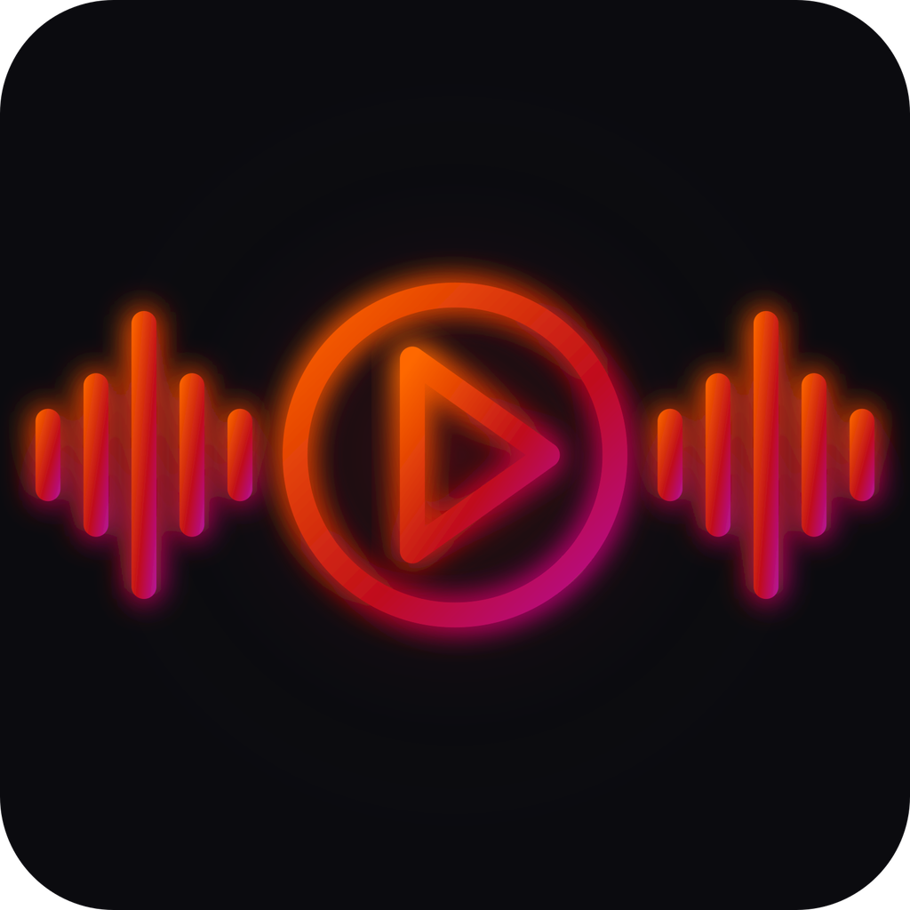

<div align="center">



<br/>

# ⚡ BeatDrive

### *Your music. Your road. Your rules.*

> A **cyberpunk-aesthetic**, ultra-stable, driver-first music player built with React Native & Expo.  
> Designed for speed, built for the road. 🚗🎵

<br/>

[](https://expo.dev)
[](https://github.com/JaiRB19/BeatDriveApp/releases)
[](./LICENSE)
[](https://expo.dev)
[](https://reactnative.dev)
[](https://typescriptlang.org)

</div>

---

## 🌟 ¿Qué es BeatDrive?

**BeatDrive** es un reproductor de música nativo diseñado exclusivamente para el conductor moderno. Olvídate de apps lentas y distractoras: BeatDrive pone el control total de tu música a un solo toque, con una interfaz oscura, neón y de alto contraste que se lee perfectamente a 120 km/h.

Sin anuncios. Sin suscripciones. Solo música. Tu música.

---

## ✨ Características Principales

### 🚗 Drive Mode — El corazón de BeatDrive
El modo de conducción es la pantalla más importante. Fue diseñada desde cero para funcionar sin que el conductor distraiga la vista de la carretera.

- **Botones gigantes** de Play, Pause, Siguiente y Anterior — imposibles de no acertar.
- **Keep-Awake activo:** La pantalla nunca se duerme mientras conduces.
- **Animación "Neon Heartbeat":** El botón de play pulsa al ritmo del estado de reproducción, dando feedback visual inmediato.
- **Visibilidad extrema:** Fondo #0B0B0F con íconos luminosos de máximo contraste.

### 🎵 Biblioteca Inteligente
- Importa canciones directamente desde tu almacenamiento con `expo-document-picker`.
- Accede a tu biblioteca local con permisos `READ_MEDIA_AUDIO`.
- **Historial de Reproducción Persistente** — Las últimas canciones escuchadas se guardan entre sesiones.
- **Búsqueda en tiempo real** con filtrado instantáneo por título y artista.
- Carátulas generadas dinámicamente por hash de color únicas por canción.

### 💎 Diseño Glassmorphism Premium
- **Barra de navegación flotante** en forma de cápsula, con fondo semi-translúcido y borde de luz neón.
- **Mini-reproductor flotante** en la biblioteca que flota inteligentemente sobre la barra de navegación.
- Paleta **Cyberpunk Neon:** Naranja (`#FF6A00`), Crimson (`#C1121F`), Azul Eléctrico (`#3A86FF`), sobre fondos Midnight Black.
- Íconos con estado activo/inactivo (relleno vs. contorno) para máxima claridad.

### 🛡️ Estabilidad Blindada
- **Reconstrucción dinámica de rutas de audio** en cada inicio: nunca más errores de "archivo no encontrado" tras reiniciar el dispositivo.
- **Deduplicación por `Map`:** Cero canciones repetidas en la biblioteca, independientemente de los recargas rápidas.
- **Borrado atómico:** Al eliminar una canción, se limpia tanto en el sistema de archivos como en el historial persistido.

### 📐 Smart Safety Area — Edge-to-Edge Nativo
Adaptación perfecta para cualquier dispositivo Android e iOS, sin importar si tiene:
- Barra de navegación de 3 botones táctiles.
- Línea de gestos del sistema (Gesture Pill).
- Notch, Dynamic Island o cámara perforada.

Gracias a `useSafeAreaInsets()`, ningún elemento de la UI colisiona con el sistema operativo.

---

## 🏗️ Stack Tecnológico

| Categoría | Tecnología | Versión |
|-----------|-----------|---------|
| **Framework** | [Expo](https://expo.dev) | `~54.0.33` |
| **Core UI** | [React Native](https://reactnative.dev) | `0.81.5` |
| **Lenguaje** | [TypeScript](https://typescriptlang.org) | `~5.9.2` |
| **Reproducción de Audio** | [expo-av](https://docs.expo.dev/versions/latest/sdk/av/) | `~16.0.8` |
| **Gestión de Estado** | [Zustand](https://zustand-demo.pmnd.rs) | `^5.0.13` |
| **Navegación** | [React Navigation v7](https://reactnavigation.org) | `^7.x` |
| **Íconos** | [@expo/vector-icons (Ionicons)](https://icons.expo.fyi) | `^15.0.3` |
| **Importar Archivos** | [expo-document-picker](https://docs.expo.dev/versions/latest/sdk/document-picker/) | `~14.0.8` |
| **Sistema de Archivos** | [expo-file-system](https://docs.expo.dev/versions/latest/sdk/filesystem/) | `~19.0.22` |
| **Biblioteca de Medios** | [expo-media-library](https://docs.expo.dev/versions/latest/sdk/media-library/) | `~18.2.1` |
| **Pantalla Activa** | [expo-keep-awake](https://docs.expo.dev/versions/latest/sdk/keep-awake/) | `~15.0.8` |
| **Safe Area** | [react-native-safe-area-context](https://github.com/th3rdwave/react-native-safe-area-context) | `~5.6.0` |
| **Slider de Audio** | [@react-native-community/slider](https://github.com/callstack/react-native-slider) | `^5.2.0` |
| **Gestos** | [react-native-gesture-handler](https://docs.swmansion.com/react-native-gesture-handler/) | `~2.28.0` |
| **Animaciones** | [react-native-reanimated](https://docs.swmansion.com/react-native-reanimated/) | `~4.1.1` |

---

## 📁 Arquitectura del Proyecto

```
BeatDrive/
├── assets/                     # Logo, íconos y splash screen
│   ├── Logo.svg                # Logotipo oficial SVG
│   ├── icon.png                # Ícono de la app (512x512)
│   └── adaptive-icon.png       # Ícono adaptativo Android
│
├── src/
│   ├── screens/                # Pantallas principales
│   │   ├── LibraryScreen.tsx   # Biblioteca + Mini-Player flotante
│   │   ├── PlayerScreen.tsx    # Reproductor completo con slider
│   │   ├── DriveModeScreen.tsx # Modo conducción de alta visibilidad
│   │   └── SettingsScreen.tsx  # Ajustes + Aviso de Privacidad
│   │
│   ├── navigation/
│   │   └── AppNavigator.tsx    # Floating Glassmorphism Tab Bar + Stack
│   │
│   ├── hooks/
│   │   ├── usePlayerStore.ts   # Estado global del reproductor (Zustand)
│   │   └── useLibrary.ts       # Motor de biblioteca + deduplicación
│   │
│   ├── constants/
│   │   └── colors.ts           # Paleta Cyberpunk Neon
│   │
│   ├── components/             # Componentes reutilizables
│   ├── services/               # Servicios de audio y archivos
│   ├── types/                  # Tipos TypeScript globales
│   └── utils/                  # Utilidades (saneamiento de rutas, etc.)
│
├── app.json                    # Config Expo (com.jai.beatdrive)
├── package.json
├── Releases.md                 # Historial de versiones
└── README.md
```

---

## 🚀 Instalación y Ejecución

### Prerrequisitos
- Node.js `>=18.x`
- Expo CLI (`npm install -g expo-cli`)
- Android Studio o Xcode (para emulador), o la app **Expo Go** en tu dispositivo físico.

### Clonar e instalar

```bash
# Clonar el repositorio
git clone https://github.com/JaiRB19/BeatDriveApp.git
cd BeatDriveApp

# Instalar dependencias
npm install

# Iniciar el servidor de desarrollo
npx expo start -c
```

### Ejecutar en dispositivo

```bash
# Android
npm run android

# iOS
npm run ios
```

> 💡 Para la mejor experiencia, ejecuta en un dispositivo físico Android. El **Modo Conducción** requiere hardware real para activar el Keep-Awake correctamente.

---

## 🔒 Privacidad

BeatDrive **no recopila ningún dato personal**. Toda la música y el historial de reproducción se almacenan exclusivamente en el almacenamiento local del dispositivo del usuario.

📜 [Ver Aviso de Privacidad completo](https://privacy-portal-rho.vercel.app/BeatDrive)

---

## 📦 Releases

| Versión | Fecha | Notas |
|---------|-------|-------|
| `v1.0.0` | 19 Mayo 2026 | 🚀 NITRO MVP — Lanzamiento inicial en Google Play Store |

Ver historial completo en **[Releases.md](./Releases.md)**

---

## 👨‍💻 Autor

<div align="center">

Desarrollado con 🧡 por

**Jai** · [@JaiRB19](https://github.com/JaiRB19)

*© 2026 Jai Apps. All rights reserved.*

</div>
