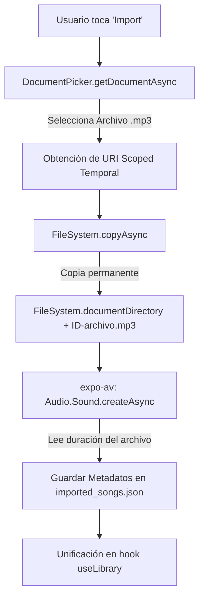
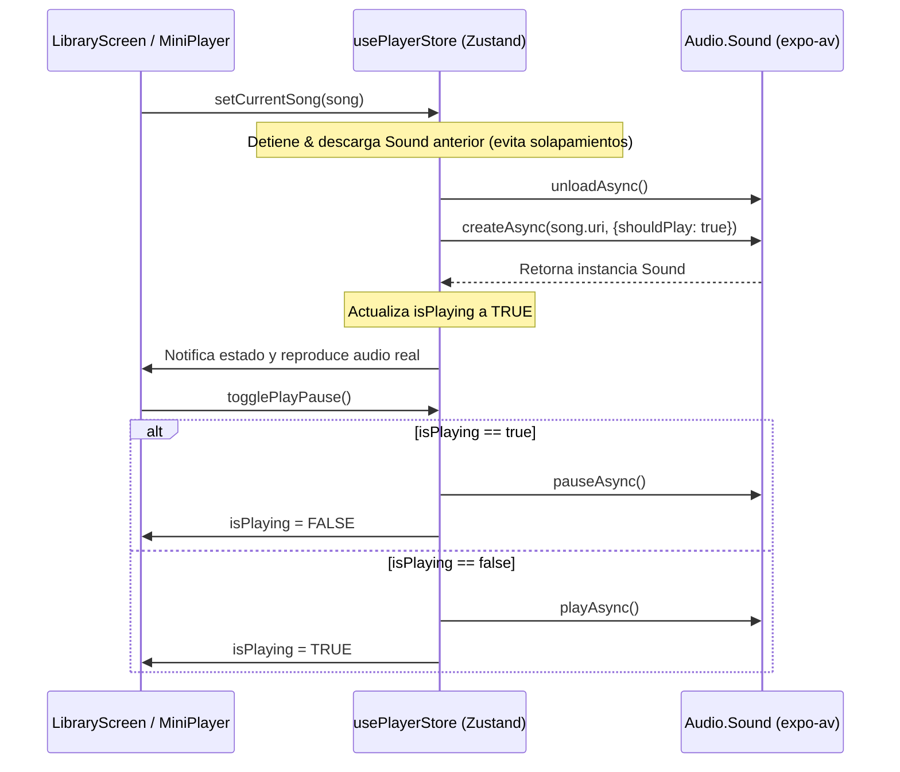

# Documentación de BeatDrive: Importación de Archivos y Motor de Audio

Este documento contiene un recuento técnico y arquitectónico detallado de los cambios realizados para dotar a la aplicación **BeatDrive** de capacidades de importación desde la nube y reproducción de sonido real.

---

## 🚀 Resumen del Logro
Antes de esta actualización, **BeatDrive** era un prototipo visual estático. Ahora cuenta con:
1. **Un sistema de importación local permanente** que permite al usuario añadir sus propios archivos `.mp3`/audio desde cualquier nube o carpeta de descargas del dispositivo.
2. **Un motor de audio nativo de alto rendimiento** conectado a un almacén global reactivo (**Zustand**), que permite reproducir, pausar e interactuar con sonido real.

---

## 🏗️ 1. Arquitectura del Sistema de Importación

Para no depender de bases de datos pesadas en esta fase, diseñamos un sistema basado enteramente en el sandbox local del dispositivo usando `expo-file-system` y `expo-document-picker`:

### Componentes Clave:
* **`expo-document-picker`**: Abre el explorador de archivos nativo (iCloud Drive en iOS, Files/Downloads/Google Drive en Android).
* **`expo-file-system`**: Nos proporciona un directorio permanente exclusivo de la aplicación (`documentDirectory`). Copiar los archivos allí garantiza que nunca se eliminen al cerrar o actualizar la aplicación.
* **Metadatos en JSON (`imported_songs.json`)**: Actúa como nuestra base de datos ligera, guardando un array con los IDs únicos, rutas locales de los archivos (`uri`), títulos limpios y duraciones reales formateadas.

---

## 🎵 2. Arquitectura del Motor de Audio (`usePlayerStore.ts`)

El reproductor musical requiere un control muy estricto para evitar bugs comunes (como canciones duplicadas sonando al mismo tiempo o fugas de memoria por instancias de reproducción colgadas).

### Características Premium Implementadas:
1. **Instancia Unificada (Singleton a nivel de módulo):** La variable `soundInstance` se declara fuera de la función del store. Esto asegura que haya exactamente **un solo reproductor** en toda la aplicación, eliminando solapamientos de audio.
2. **Audio en Segundo Plano (Background Audio):** Inicializamos el sistema mediante `Audio.setAudioModeAsync` con las configuraciones:
   * `staysActiveInBackground: true`: Permite que la música continúe reproduciéndose si sales de la aplicación o bloqueas la pantalla.
   * `playsInSilentModeIOS: true`: Asegura que el sonido funcione en dispositivos iOS aunque el switch físico de silencio esté activo.
3. **Liberación de Memoria Proactiva:** Cada vez que se cambia de pista, el reproductor detiene el audio y llama a `unloadAsync()`. Esto vacía por completo el búfer de audio de la memoria RAM del teléfono, optimizando el uso de la batería y el rendimiento general de la app.
4. **Monitoreo Automático de Eventos:** El store se suscribe al evento `setOnPlaybackStatusUpdate`. Si la canción termina por completo, cambia automáticamente el estado `isPlaying` a `false` en la interfaz.

---

## 🛠️ 3. Archivos Modificados y sus Roles

### 📂 [useLibrary.ts](file:///c:/Users/jaiel/OneDrive/Escritorio/Proyectos/BeatDrive/src/hooks/useLibrary.ts)
* **Responsabilidad:** Gestionar la colección de música disponible.
* **Cambios:**
  * Lee el JSON de almacenamiento local (`imported_songs.json`) al iniciar.
  * Lanza el selector de documentos y clona físicamente el archivo en el sandbox.
  * Mapea y une las canciones del dispositivo (`MediaLibrary`) con las canciones locales del cloud en un único array `songs` exportado de forma unificada.
  * Añade la función `deleteImportedSong` para eliminar físicamente archivos y metadatos de la memoria si el usuario desea eliminarlos.

### 📂 [usePlayerStore.ts](file:///c:/Users/jaiel/OneDrive/Escritorio/Proyectos/BeatDrive/src/hooks/usePlayerStore.ts)
* **Responsabilidad:** Controlar la reproducción de audio nativo y propagar el estado a toda la app de forma reactiva.
* **Cambios:**
  * Implementó las funciones asíncronas para comunicarse con las APIs nativas de `expo-av`.
  * Maneja la transición del estado de reproducción (`isPlaying`, `currentSong`).

### 📂 [LibraryScreen.tsx](file:///c:/Users/jaiel/OneDrive/Escritorio/Proyectos/BeatDrive/src/screens/LibraryScreen.tsx)
* **Responsabilidad:** Renderizar la biblioteca y permitir acciones de usuario.
* **Cambios:**
  * Se removió el bloqueo estricto por falta de permisos de la biblioteca multimedia local. Si no hay permisos, la app muestra un discreto _banner_ en la sección y permite seguir usando la biblioteca mediante importación directa.
  * Conectó el nuevo botón naranja **"Import"** a la función `importSong()`.

---

## 📋 4. Siguientes Pasos Recomendados en el Roadmap
Con las bases sólidas de audio y persistencia local completadas, el proyecto está en una posición inmejorable para avanzar a:
1. **Modo Conducción Real (Drive Mode):** Crear una pantalla con diseño minimalista, botones gigantescos y comandos de gestos táctiles (swipe para cambiar canción, doble toque para pausar) optimizada para su uso mientras se conduce.
2. **Barra de Progreso y Volumen del Mini-Player:** Añadir deslizadores (`Sliders`) funcionales para saltar a partes específicas de la canción y alterar el volumen.
3. **Lista de Reproducción Dinámica (Queue):** Hacer que cuando una canción termine, salte automáticamente a la siguiente disponible en la lista en lugar de detenerse.
